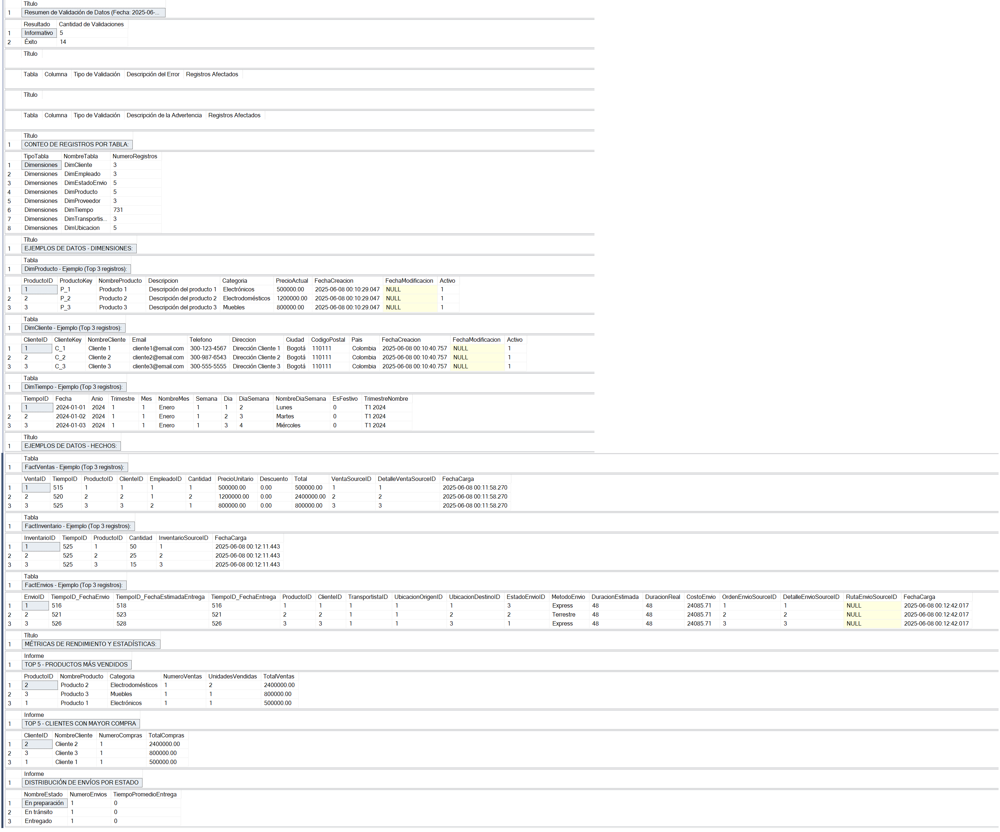

# Data Warehouse Temu Colombia

Este proyecto implementa un data warehouse completo para Temu Colombia, transformando datos de un sistema OLTP a un modelo dimensional optimizado para análisis y reportes.

## Estructura de Archivos

- **00_ejecutar_todo.sql**: Script maestro que ejecuta todos los scripts en secuencia
- **01_crear_data_warehouse.sql**: Crea la estructura del data warehouse con dimensiones y hechos
- **02_cargar_dimensiones.sql**: Carga de datos en las tablas de dimensiones
- **03_cargar_tablas_hechos.sql**: Carga de datos en las tablas de hechos
- **04_limpieza_y_calidad_datos.sql**: Procesos de limpieza y verificación de calidad
- **05_carga_incremental.sql**: Configuración para cargas incrementales
- **06_metadatos.sql**: Generación de metadatos del data warehouse
- **07_validacion_datos.sql**: Validación completa de datos y generación de informes
- **documentacion_dw.md**: Documentación detallada del data warehouse

## Modelo Dimensional

### Tablas de Dimensiones
- **DimTiempo**: Dimensión de tiempo con granularidad diaria
- **DimProducto**: Productos con atributos descriptivos y precios
- **DimCliente**: Información de clientes
- **DimEmpleado**: Datos de empleados y vendedores
- **DimProveedor**: Información de proveedores
- **DimTransportista**: Datos de empresas de transporte
- **DimUbicacion**: Ubicaciones geográficas
- **DimEstadoEnvio**: Estados posibles de los envíos

### Tablas de Hechos
- **FactVentas**: Registro de ventas con cantidades y montos
- **FactInventario**: Seguimiento de inventario de productos
- **FactEnvios**: Registro de envíos y entregas

## Instrucciones de Uso

Para implementar el data warehouse completo:

1. Ejecutar el script maestro `00_ejecutar_todo.sql`

Para validar la calidad e integridad de los datos:

1. Ejecutar el script `07_validacion_datos.sql`

## Consideraciones Técnicas

- Base de datos fuente: BDTemuColombia
- Base de datos destino: DW_TemuColombia
- Motor de base de datos: Microsoft SQL Server
- Se implementan técnicas SCD Tipo 2 para mantener el historial de cambios en dimensiones clave

Consulta el archivo documentacion_dw.md para información detallada sobre arquitectura, ETL y consideraciones de implementación.
